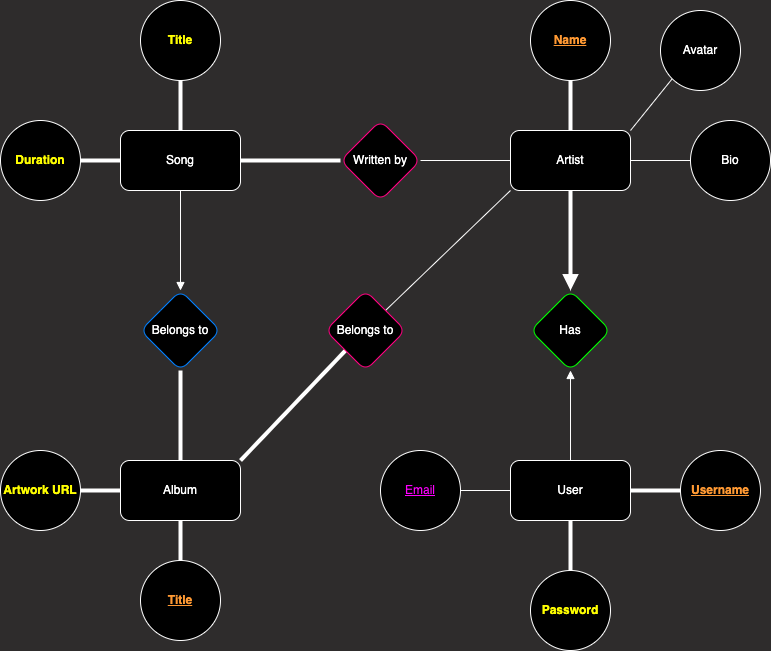

# Music Store (Database)

Use this document to understand the database schema and relations for the Music Store project. You can use this document to help you create your database and tables. You can also use this document to help you create your models and relations in your application.

## ERD

---

## Tables

### `users` Schema

❗ **NOTE:** You can use the framework's built-in `User` model for this table. If you don't want to use the built-in `User` model, you can create your own `users` table with the following schema and you will need to implement your own authentication system.

| Column | Type | Notes |
| --- | --- | --- |
| `id` | Integer | Primary Key |
| `username` | String | Not Null, Unique |
| `email` | String | Unique |
| `password` | String | Not Null |

### `artists` Schema

| Column | Type | Notes |
| --- | --- | --- |
| `id` | Integer | Primary Key |
| `name` | String | Not Null |
| `bio` | String | Not Null |

### `albums` Schema

| Column | Type | Notes |
| --- | --- | --- |
| `id` | Integer | Primary Key |
| `title` | String | Not Null |
| `artwork_url` | String | Not Null |

### `songs` Schema

| Column | Type | Notes |
| --- | --- | --- |
| `id` | Integer | Primary Key |
| `title` | String | Not Null |
| `duration` | Integer | Not Null |

---

## Relations

### `users` Relations

- Has one `artists` (optional) (one-to-one)
  
### `artists` Relations

- Belongs to `users` (required) (one-to-one)
- Has many `songs` (optional) (many-to-many) through `artist_songs`
- Has many `albums` (optional) (many-to-many) through `artist_albums`

### `albums` Relations

- Has many `artists` (required) (many-to-many) through `artist_albums`
- Has many `songs` (required) (one-to-many)

### `songs` Relations

- Belongs to `albums` (optional) (one-to-many)
- Has many `artists` (required) (many-to-many) through `artist_songs`
